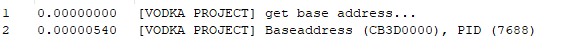
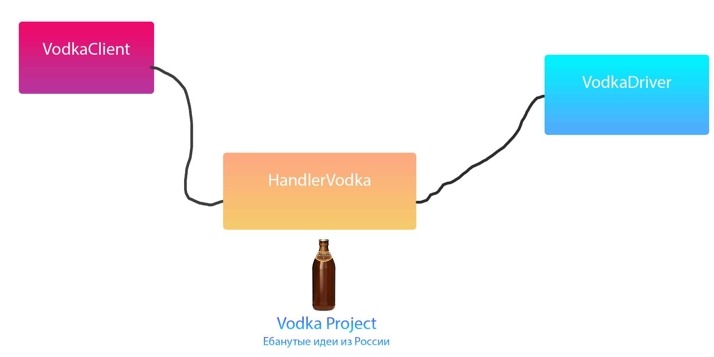

.png "LOGO")

# VodkaProject
Fucking ideas from Russia with love &lt;3
Work speed:

How to use?
1. Start VodkaHandler.
2. Use kdmapper (which is in the compiled folder)
3. Use as you wish, you can see an example in ClientVodka

